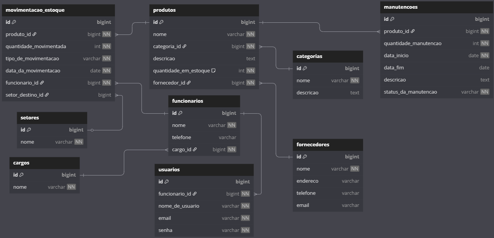

# Controle de Estoque - Backend  

Este projeto tem como objetivo realizar o controle de estoque de equipamentos de infraestrutura para empresas em geral. O sistema gerencia a quantidade de equipamentos, como mouses, teclados e outros, sendo utilizado pelo time de infraestrutura das empresas.  

## 📌 Funcionalidades  

- **Cadastro de Produtos**: Cadastro de equipamentos no estoque com informações como nome, categoria, fornecedor e quantidade inicial.  
- **Movimentação de Estoque**: Registro de entradas e saídas de equipamentos do estoque. Para realizar movimentações, é necessário informar um funcionário responsável pela movimentação.  

## 🛠 Tecnologias Utilizadas  

- **Spring Boot** para o backend.  
- **PostgreSQL** como banco de dados.  
- **Java** para a implementação da lógica de negócios.  
- **Spring Security** para autenticação e controle de acesso.  

## 🔄 Fluxo de Movimentações  

Ao registrar movimentações, é necessário:  

- **Informar um funcionário responsável** pela movimentação.  
- **Controle de acesso**: Nem todo usuário terá acesso ao sistema, já que todo usuário é um funcionário, mas nem todo funcionário é um usuário.  

## 🗂 Diagrama do Banco de Dados  

A estrutura do banco de dados pode ser visualizada no diagrama abaixo:  



> ⚠️ **Observação**: Para visualizar o diagrama, certifique-se de acessar o link diretamente.  

## 🚀 Como rodar o projeto  

1. **Clonar o repositório**  
   ```bash
   git clone https://github.com/kauannlima/springestoque-backend
   ```  

2. **Configurar o banco de dados**  
   O projeto utiliza o **PostgreSQL**. Certifique-se de configurar o banco de dados corretamente no `application.properties`.  

3. **Rodar a aplicação**  
   Execute o comando abaixo para iniciar o servidor:  
   ```bash
   ./mvnw spring-boot:run
   ```  

4. **SQL para Teste**  
   O projeto inclui arquivos SQL para teste e adicionar itens nas tabelas. Eles podem ser encontrados no seguinte caminho:  
   ```
   src/main/resources/db
   ```  

## 📜 Licença  

Este projeto é licenciado sob a MIT License - veja o arquivo [LICENSE](LICENSE) para mais detalhes.  
